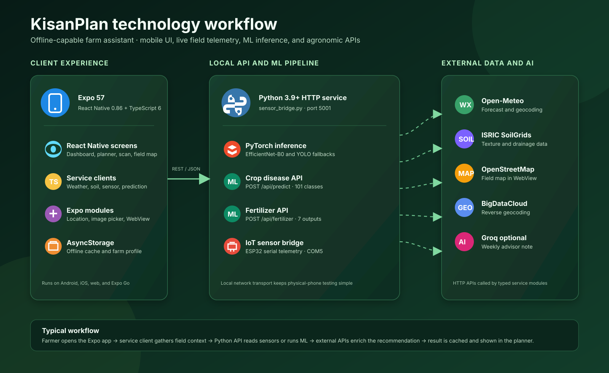

# KisanPlan

KisanPlan is an Expo / React Native farm assistant for Indian farmers. It combines live weather, IoT soil-moisture telemetry, on-device ML crop-disease classification, and fertilizer recommendation into a single offline-capable mobile and web app.

---

## Features

| Feature | Description |
|---------|-------------|
| 🌦️ **7-Day Farm Planner** | Irrigation and spraying decisions from live Open-Meteo weather |
| 💧 **IoT Soil Moisture** | ESP32 + moisture sensor over Wi-Fi on COM5 |
| 🔬 **Crop Disease Scan** | EfficientNet-B0 (101 classes) — 99%+ confidence on test set |
| 🌱 **Fertilizer Recommendation** | FertilizerMLP model (7 fertilizers, 19 real inputs) |
| 🗺️ **Field Map** | OpenStreetMap WebView with GPS field selection |
| 🌐 **Auto Language** | App switches to regional language based on farm location |
| 📊 **Soil Data** | SoilGrids API — texture, drainage, field capacity |
| 🤖 **AI Advisor** | Optional Groq week summary note |

---

## Architecture



See the [detailed architecture and component relationships](.github/modernize/assessment/engines/facts/architecture-diagram.md) for the Mermaid diagrams and technology inventory.

```text
Expo client (React Native / Web)
  │
  ├── Open-Meteo forecast + geocoding API
  ├── BigDataCloud reverse geocoding API
  ├── ISRIC SoilGrids API
  ├── Optional Groq API (advisor notes)
  │
  ├── POST /api/predict ──────► Python sensor_bridge.py
  │                               ├── weights/crop_disease_model.pt   ← EfficientNet-B0 (primary)
  │                               ├── weights/disease.pt              ← YOLO (fallback)
  │                               └── weights/best.pt                 ← YOLO (fallback 2)
  │
  ├── POST /api/fertilizer ───► Python sensor_bridge.py
  │                               └── weights/fertilizer_recommendation_model.pt  ← FertilizerMLP
  │
  └── GET  /api/sensor ───────► Python sensor_bridge.py
                                  └── optional ESP32 on COM5
```

---

## Project Structure

```text
E:\Asymptote_PS09\
├── server\
│   ├── sensor_bridge.py              ← HTTP server (all endpoints)
│   ├── predict_crop.py               ← EfficientNet-B0 + YOLO inference
│   ├── predict_fertilizer.py         ← FertilizerMLP inference
│   ├── disease_info.json             ← Disease knowledge base (100+ entries)
│   ├── crop_disease_classes.json     ← 101 disease class labels
│   ├── fertilizer_classes.json       ← 7 fertilizer class labels
│   └── requirements.txt
├── weights\
│   ├── crop_disease_model.pt         ← EfficientNet-B0 (14.85 MB) ← PRIMARY
│   ├── fertilizer_recommendation_model.pt ← FertilizerMLP (0.45 MB)
│   ├── disease.pt                    ← YOLO fallback
│   └── best.pt                       ← YOLO fallback 2
├── sample_images\                    ← 504 test images (5 per class, 101 classes)
│   ├── Apple__Healthy\
│   ├── Corn__gray_leaf_spot\
│   └── ... (101 class folders)
├── services\
│   ├── predictService.ts             ← Crop disease API client
│   ├── fertilizerService.ts          ← Fertilizer recommendation API client
│   ├── sensorService.ts              ← IoT sensor API client
│   ├── weatherService.ts             ← Open-Meteo weather
│   └── ...
├── i18n\translations.ts              ← 9 Indian languages
├── context\LanguageContext.tsx       ← Auto language from GPS location
└── .env                              ← Server IP config
```

---

## ML Models

### Crop Disease Model — EfficientNet-B0

| Property | Value |
|----------|-------|
| Architecture | EfficientNet-B0 (torchvision) |
| Classes | 101 crop-disease combinations |
| Image size | 224 × 224 |
| Trained on | 53,799 images (70/15/15 split) |
| Weight file | `weights/crop_disease_model.pt` (14.85 MB) |
| Fallback | `weights/disease.pt` → `weights/best.pt` (YOLO) |

Supported crops: Apple, Banana, Bellpepper, Carrot, Cassava, Cherry, Chili, Coffee, Corn, Cucumber, Guava, Jamun, Jujube, Lemon, Mango, Orange, Peach, Pomegranate, Potato, Rice, Soybean, Strawberry, Sugarcane, Tea, Tomato, Wheat.

### Fertilizer Recommendation Model — FertilizerMLP

| Property | Value |
|----------|-------|
| Architecture | MLP: 19 → 256 → 256 → 128 → 64 → 7 |
| Classes | Compost, DAP, MOP, NPK, SSP, Urea, Zinc Sulphate |
| Input features | 19 (soil + weather + crop context) |
| Trained on | 10,000 rows (70/15/15 split) |
| Best val accuracy | 85.67% |
| Weight file | `weights/fertilizer_recommendation_model.pt` (0.45 MB) |

**Real inputs currently used by the app:**

| Feature | Source |
|---------|--------|
| `Crop_Type` | Photo scan result |
| `Crop_Growth_Stage` | Farm Setup profile |
| `Temperature` | Live weather API |
| `Humidity` | Live weather API |
| `Rainfall` | Live weather API |
| `Soil_Moisture` | IoT sensor (ESP32) |
| `Season` | Current calendar month |

Remaining features (N, P, K, pH, etc.) use agronomic defaults until soil test hardware is connected.

---

## Prerequisites

### Expo app
- Node.js 18+
- Expo CLI (`npm install -g expo-cli`)

### Python server
- Python 3.9+ (`C:\Users\HP\miniconda\python.exe`)
- PyTorch 2.x (CPU is fine)
- torchvision, pillow, pyserial, numpy

### Optional hardware
- ESP32 dev board on **COM5** (115200 baud)
- Soil moisture sensor on GPIO 34
- Pump relay on GPIO 26

---

## First-time Installation

```powershell
cd E:\Asymptote_PS09
npm install
C:\Users\HP\miniconda\python.exe -m pip install -r server\requirements.txt
```

### `.env` file (required for physical phone)

Create `E:\Asymptote_PS09\.env`:

```env
EXPO_PUBLIC_MODEL_URL=http://192.168.0.106:5001
EXPO_PUBLIC_IOT_SENSOR_URL=http://192.168.0.106:5001
```

Replace `192.168.0.106` with your PC's local IP (`ipconfig` → IPv4 Address).

> **Web browser** on the same PC does not need the `.env` — the app auto-connects to `localhost:5001`.

---

## Run the Project

Open **two PowerShell terminals**:

### Terminal 1 — Python Server

```powershell
cd E:\Asymptote_PS09\server
C:\Users\HP\miniconda\python.exe sensor_bridge.py
```

Successful startup output:

```text
[OK] Loaded PyTorch EfficientNet-B0 model ... (101 classes)
[OK] Loaded FertilizerMLP ... (7 classes, 19 features)
sensor api     http://0.0.0.0:5001/api/sensor
predict api    http://0.0.0.0:5001/api/predict
fertilizer api http://0.0.0.0:5001/api/fertilizer
```

> `serial wait COM5: could not open port` is normal without an ESP32 — everything still works.

### Terminal 2 — Expo App

```powershell
cd E:\Asymptote_PS09
npx expo start --clear
```

Then press:
- **`w`** — open in browser
- **`a`** — Android emulator
- Scan QR with **Expo Go** on your phone

---

## API Endpoints

### `GET /api/sensor`
Returns live IoT sensor state, pump status, motor history, and statistics.

### `POST /api/sensor`
Accepts a manual sensor reading:
```json
{ "soilMoisture": 42 }
```

### `POST /api/predict`
Accepts a base64 crop image, returns disease classification:
```json
{ "imageBase64": "<base64>" }
```
Response includes: `crop`, `detected`, `confidence`, `confidence_pct`, `confidence_level`, `status`, `treatment`, `prevention`, `top_predictions`.

### `POST /api/fertilizer`
Accepts 19 soil/crop feature values, returns fertilizer recommendation:
```json
{
  "features": {
    "Crop_Type": "Corn",
    "Temperature": 30,
    "Soil_Moisture": 45,
    ...
  }
}
```
Response: `recommended_fertilizer`, `confidence`, `confidence_pct`, `confidence_level`, `top_k`.

---

## Test with Sample Images

504 test images (5 per class × 101 classes) are in `sample_images\`:

```powershell
# Example: test Tomato late blight
# App → Scan Crop → Choose photo → sample_images\Tomato__late_blight\
```

---

## Language Support

The app auto-detects the regional language when a location is saved in Farm Setup:

| State | Language |
|-------|----------|
| Maharashtra | Marathi |
| Punjab / Haryana | Punjabi |
| Gujarat | Gujarati |
| Tamil Nadu | Tamil |
| Karnataka | Kannada |
| Telangana / AP | Telugu |
| West Bengal | Bengali |
| Rajasthan / UP / MP | Hindi |
| Others | English (default) |

Tap the 🌐 pill in the app header to switch language manually at any time.

---

## ESP32 Setup

Edit `farmer_iot/src/main.cpp` before flashing:

```cpp
const char* ssid       = "YOUR_WIFI_SSID";
const char* password   = "YOUR_WIFI_PASSWORD";
const char* serverName = "http://192.168.0.106:5001/api/sensor";
```

Hardware pins:

| Component | GPIO |
|-----------|------|
| Soil sensor | 34 |
| Pump relay | 26 |
| Red LED (pump off) | 25 |
| Blue LED (standby) | 27 |

---

## Environment Variables

| Variable | Purpose |
|----------|---------|
| `EXPO_PUBLIC_MODEL_URL` | Python server URL for `/api/predict` and `/api/fertilizer` |
| `EXPO_PUBLIC_IOT_SENSOR_URL` | Python server URL for `/api/sensor` |
| `EXPO_PUBLIC_GROK_API_KEY` | Optional Groq API key for AI advisor notes |
| `EXPO_PUBLIC_GROK_MODEL` | Optional Groq model name |

---

## Troubleshooting

### `Failed to fetch` on web browser
The app auto-uses `localhost:5001` on web. Just make sure the Python server is running.

### `Failed to fetch` on physical phone
Set your PC's IP in `.env` and restart Expo with `--clear`. Phone and PC must be on the same Wi-Fi.

### `No module named torchvision`
```powershell
C:\Users\HP\miniconda\python.exe -m pip install torchvision --index-url https://download.pytorch.org/whl/cpu
```

### `serial wait COM5: could not open port`
Normal without ESP32. Change `COM_PORT` in `server/sensor_bridge.py` if your board uses a different port.

### TypeScript errors
```powershell
cd E:\Asymptote_PS09
npx tsc --noEmit
```

---

## Validation

```powershell
# TypeScript
npx tsc --noEmit

# Expo config
npx expo-doctor

# Test fertilizer model directly
C:\Users\HP\miniconda\python.exe server\predict_fertilizer.py

# Verify server endpoints
Invoke-WebRequest http://127.0.0.1:5001/api/sensor -UseBasicParsing
```
